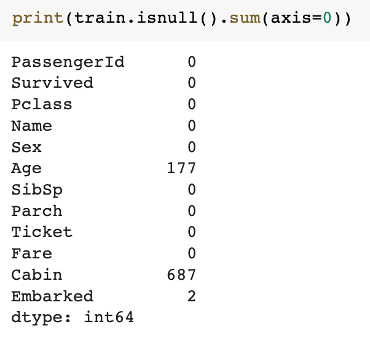
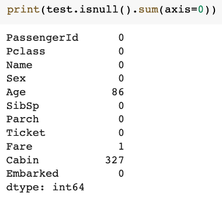
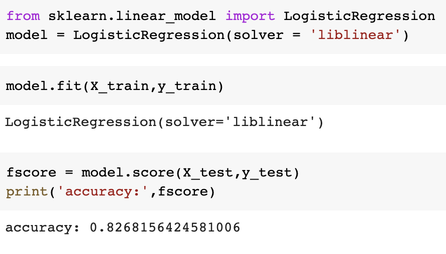

# 人工智慧實務課程

## Homework 3

- Train和Test資料缺失的部分：

  

  

- 對於Age，使用Mean平均值進行補值
-	對於Cabin，所有缺失值用“Unknown”補值
-	對於Fare，使用Mean平均值進行補值
-	對於Embarked，使用Mode眾數進行補值
-	模型選擇Logistic Regression
-	模型準確率為：0.8100558659217877

  

# Student ID: 408449014
